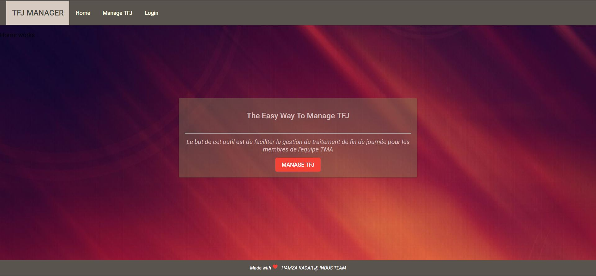

# TFJ_STAT

This is a webapp for managing TFJ [  End Of Day Treatment ] which is done in the banks.

## Why this application?

- To facilitate the management of TFJ end-of-day processing to meet the TMA team's needs.
- To automate the supervision of the bypassed program.
- To Help the TMA Team.

## Use Cases

### Admin 

- Get Filiales.
- Get Hosts by Filiale name.
- Lunch scripts Before TFJ & Change Date comptable & Send Mail.
- Lunch scripts After TFJ & Send Mail.
- Access statistics of TFJ.
- Check number of TFJ lunched ( every host ) [ every week ].
- check bypassed programs.
- check evlog.

### TMA member 

- Get Filiales.
- Get Hosts by Filiale name.
- Lunch scripts Before TFJ & Change Date comptable & Send Mail.
- Lunch scripts After TFJ & send Mail.

### Guest [ Module Docs ]

- Check Doc Amplitude.
- Check Doc Oracle.
- Check Doc Informix.
- Check Code Errors.
- Check Help Files.

### Vue of Module Documentation  : 

